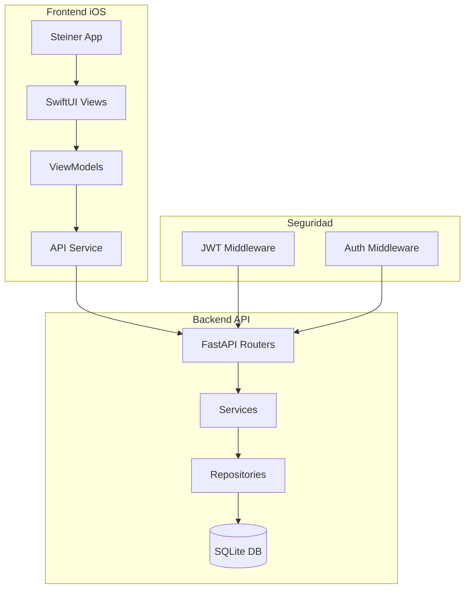

# 📚 Sistema de Gestión Escolar - API Móvil

<div align="center">


**Sistema integral para la gestión escolar con API REST y aplicación móvil iOS**

[Características](#-características) • [Arquitectura](#-arquitectura) • [Instalación](#-instalación) • [API Docs](#-documentación-de-la-api) • [Frontend iOS](#-frontend-ios)

</div>

---

## 📋 Descripción

Este proyecto es un **Sistema de Gestión Escolar** diseñado para facilitar la administración académica mediante una API REST robusta y una aplicación móvil nativa para iOS. Permite la gestión completa de usuarios (maestros y alumnos), tareas, clases, entregas de trabajos y control de asistencia mediante códigos QR.

### 🎯 Objetivos del Proyecto

- Digitalizar y optimizar los procesos administrativos escolares
- Proporcionar una plataforma accesible desde dispositivos móviles
- Automatizar el control de asistencia mediante tecnología QR
- Facilitar la comunicación entre maestros y alumnos

---

## ✨ Características

### Backend (API REST)

| Módulo | Descripción |
|--------|-------------|
| 🔐 **Autenticación** | Sistema de login/registro con JWT tokens |
| 👥 **Usuarios** | Gestión de maestros y alumnos con roles diferenciados |
| 📝 **Tareas** | CRUD completo de tareas por clase |
| 📖 **Clases** | Administración de cursos y grupos |
| 📤 **Entregas** | Sistema de entrega de trabajos con archivos |
| ✅ **Asistencias** | Control de asistencia con soporte QR |
| 📋 **Inscripciones** | Gestión de inscripciones de alumnos a clases |

### Frontend iOS (Steiner App)

| Vista | Funcionalidad |
|-------|---------------|
| 🔑 **Login** | Autenticación de usuarios |
| 📚 **Grupos** | Visualización de clases inscritas |
| ✏️ **Tareas** | Ver, crear, editar y eliminar tareas |
| 📱 **QR Scanner** | Escaneo de QR para registro de asistencia |
| 📊 **Asistencias** | Historial y gestión de asistencias |
| 📄 **Entregas** | Subida de archivos y calificaciones |

---

## 🏗️ Arquitectura

### Estructura del Proyecto

```
ProyectoAPIMovilEscolar/
├── backend/
│   ├── app/
│   │   ├── main.py                 # Punto de entrada FastAPI
│   │   ├── database.py             # Configuración SQLAlchemy
│   │   ├── dependencies.py         # Inyección de dependencias
│   │   ├── exceptions.py           # Manejadores de excepciones
│   │   │
│   │   ├── models/                 # Modelos ORM
│   │   │   ├── user.py
│   │   │   ├── tarea.py
│   │   │   ├── clase.py
│   │   │   ├── entrega.py
│   │   │   ├── asistencia.py
│   │   │   └── inscripciones.py
│   │   │
│   │   ├── schemas/                # Esquemas Pydantic
│   │   │   ├── user.py
│   │   │   ├── tarea.py
│   │   │   ├── clase.py
│   │   │   ├── entrega.py
│   │   │   ├── asistencia.py
│   │   │   └── token.py
│   │   │
│   │   ├── routers/                # Endpoints de la API
│   │   │   ├── auth.py
│   │   │   ├── user_router.py
│   │   │   ├── tarea_router.py
│   │   │   ├── clase_router.py
│   │   │   ├── entrega_router.py
│   │   │   ├── asistencia.py
│   │   │   └── inscripcion_router.py
│   │   │
│   │   ├── services/               # Lógica de negocio
│   │   ├── repositories/           # Acceso a datos
│   │   ├── middlewares/            # Auth & Request Context
│   │   └── utils/                  # JWT & Password utils
│   │
│   ├── escuela.db                  # Base de datos SQLite
│   └── requirements.txt            # Dependencias Python
│
└── frontend/
    └── Steiner/                    # App iOS (Swift)
        ├── Views/                  # Vistas SwiftUI
        ├── ViewModels/             # View Models
        ├── Models/                 # Modelos de datos
        ├── Services/               # Servicios de API
        └── Assets.xcassets/        # Recursos gráficos
```

### Diagrama de Arquitectura



---

## 🚀 Instalación

### Requisitos Previos

- **Python** 3.10 o superior
- **pip** (gestor de paquetes de Python)
- **Xcode** 14+ (para el frontend iOS)
- **iOS** 16+ (para la app móvil)

### Backend (API)

```bash
# 1. Navegar al directorio del backend
cd ProyectoAPIMovilEscolar/backend

# 2. Crear entorno virtual
python -m venv venv

# 3. Activar entorno virtual
source venv/bin/activate  # macOS/Linux
# o
.\venv\Scripts\activate   # Windows

# 4. Instalar dependencias
pip install -r requirements.txt

# 5. Iniciar el servidor
uvicorn app.main:app --reload --host 0.0.0.0 --port 8000
```

### Frontend iOS

```bash
# 1. Navegar al directorio del frontend
cd ProyectoAPIMovilEscolar/frontend

# 2. Abrir el proyecto en Xcode
open Steiner.xcodeproj

# 3. Seleccionar simulador o dispositivo y ejecutar (⌘ + R)
```

---

## 📖 Documentación de la API

### URL Base

```
http://localhost:8000
```

### Documentación Interactiva

Una vez el servidor esté corriendo, accede a la documentación automática:

- **Swagger UI**: [http://localhost:8000/docs](http://localhost:8000/docs)
- **ReDoc**: [http://localhost:8000/redoc](http://localhost:8000/redoc)

---

### 🔐 Autenticación (`/auth`)

| Método | Endpoint | Descripción | Auth |
|--------|----------|-------------|------|
| `POST` | `/auth/register` | Registrar nuevo usuario | ❌ |
| `POST` | `/auth/login` | Iniciar sesión | ❌ |

#### Registro de Usuario

```http
POST /auth/register
Content-Type: application/json

{
  "matricula": "A12345",
  "nombre": "Juan Pérez",
  "password": "contraseña123",
  "rol": "alumno"
}
```

#### Login

```http
POST /auth/login
Content-Type: application/json

{
  "matricula": "A12345",
  "password": "contraseña123"
}
```

**Respuesta:**
```json
{
  "access_token": "eyJhbGciOiJIUzI1NiIs...",
  "token_type": "bearer",
  "rol": "alumno",
  "id": 1
}
```

---

### 👥 Usuarios (`/user`)

| Método | Endpoint | Descripción | Auth |
|--------|----------|-------------|------|
| `GET` | `/user/me` | Obtener usuario actual | ✅ |
| `GET` | `/user/alumnos` | Listar todos los alumnos | ✅ |
| `GET` | `/user/maestros` | Listar todos los maestros | ✅ |
| `GET` | `/user/{id}` | Obtener usuario por ID | ✅ |
| `PUT` | `/user/update/{id}` | Actualizar usuario | ✅ |
| `GET` | `/user/{id}/clases` | Obtener clases de un alumno | ✅ |

---

### 📝 Tareas (`/tareas`)

| Método | Endpoint | Descripción | Auth |
|--------|----------|-------------|------|
| `POST` | `/tareas/` | Crear nueva tarea | 🔒 Maestro |
| `GET` | `/tareas/` | Listar todas las tareas | ✅ |
| `GET` | `/tareas/{id}` | Obtener tarea por ID | 🔒 Maestro |
| `PUT` | `/tareas/{id}` | Actualizar tarea | 🔒 Maestro |
| `DELETE` | `/tareas/{id}` | Eliminar tarea | 🔒 Maestro |
| `GET` | `/tareas/clase/{clase_id}` | Tareas por clase | ✅ |

#### Crear Tarea

```http
POST /tareas/
Authorization: Bearer {token}
Content-Type: application/json

{
  "titulo": "Examen Parcial",
  "descripcion": "Temas 1-5 del libro",
  "fecha_entrega": "2024-12-25T23:59:00",
  "clase_id": 1
}
```

---

### 📖 Clases (`/clases`)

| Método | Endpoint | Descripción | Auth |
|--------|----------|-------------|------|
| `POST` | `/clases/` | Crear nueva clase | 🔒 Maestro |
| `GET` | `/clases/` | Listar todas las clases | ✅ |
| `GET` | `/clases/{id}` | Obtener clase por ID | ✅ |
| `GET` | `/clases/{id}/alumnos` | Alumnos de una clase | ✅ |

---

### 📤 Entregas (`/entregas`)

| Método | Endpoint | Descripción | Auth |
|--------|----------|-------------|------|
| `POST` | `/entregas/tarea/{tarea_id}` | Entregar tarea (con archivo) | ✅ |
| `POST` | `/entregas/tarea/{tarea_id}/alumno/{alumno_id}` | Entrega presencial | ✅ |
| `GET` | `/entregas/tarea/{tarea_id}` | Entregas por tarea | ✅ |
| `PUT` | `/entregas/{entrega_id}` | Actualizar entrega (calificar) | ✅ |

#### Subir Entrega

```http
POST /entregas/tarea/1
Authorization: Bearer {token}
Content-Type: multipart/form-data

file: [archivo.pdf]
```

---

### ✅ Asistencias (`/asistencias`)

| Método | Endpoint | Descripción | Auth |
|--------|----------|-------------|------|
| `POST` | `/asistencias/` | Registrar asistencia | 🔒 Maestro |
| `GET` | `/asistencias/` | Listar todas | ✅ |
| `GET` | `/asistencias/{id}` | Obtener por ID | ✅ |
| `GET` | `/asistencias/fecha` | Por fecha y clase | ✅ |
| `GET` | `/asistencias/clase/{id}` | Por clase | 🔒 Maestro |
| `GET` | `/asistencias/alumno/{id}` | Por alumno | 🔒 Alumno |
| `GET` | `/asistencias/alumno/{id}/clase/{id}` | Por alumno y clase | 🔒 Alumno |

---

## 📱 Frontend iOS

### Aplicación Steiner

La aplicación móvil **Steiner** está desarrollada en Swift utilizando SwiftUI para una experiencia de usuario moderna y fluida.

### Vistas Principales

| Vista | Archivo | Descripción |
|-------|---------|-------------|
| Login | `LoginView.swift` | Pantalla de autenticación |
| Grupos | `GruposView.swift` | Lista de clases inscritas |
| Ver Tareas | `VerTareasView.swift` | Lista de tareas del alumno |
| Crear Tarea | `CrearTareaView.swift` | Formulario para maestros |
| Editar Tarea | `EditarTareaView.swift` | Edición de tareas existentes |
| Asistencias | `AsisView.swift` | Gestión de asistencias |
| QR Scanner | `SignQRView.swift` | Escaneo QR para asistencia |
| Calificar | `CalTareaView.swift` | Calificación de entregas |

### Configuración de la API

Configura la URL base de la API en el archivo de servicios:

```swift
// Services/APIService.swift
let baseURL = "http://tu-servidor:8000"
```

---

## 🔧 Tecnologías Utilizadas

### Backend

| Tecnología | Uso |
|------------|-----|
| **FastAPI** | Framework web moderno y de alto rendimiento |
| **SQLAlchemy** | ORM para manejo de base de datos |
| **SQLite** | Base de datos ligera |
| **Pydantic** | Validación de datos |
| **JWT** | Tokens de autenticación |
| **Passlib + Bcrypt** | Hash seguro de contraseñas |
| **Supabase** | Almacenamiento de archivos |
| **Uvicorn** | Servidor ASGI |

### Frontend

| Tecnología | Uso |
|------------|-----|
| **Swift 5** | Lenguaje de programación |
| **SwiftUI** | Framework de UI declarativo |
| **AVFoundation** | Escaneo de códigos QR |
| **Combine** | Programación reactiva |

---

## 🤝 Contribución

1. **Fork** el repositorio
2. Crea una rama para tu feature: `git checkout -b feature/nueva-funcionalidad`
3. Realiza tus cambios y haz commit: `git commit -m 'feat: agrega nueva funcionalidad'`
4. Sube los cambios: `git push origin feature/nueva-funcionalidad`
5. Abre un **Pull Request**

### Convenciones de Commits

Utilizamos [Conventional Commits](https://www.conventionalcommits.org/):

- `feat:` Nueva funcionalidad
- `fix:` Corrección de bugs
- `docs:` Cambios en documentación
- `style:` Formato de código
- `refactor:` Refactorización
- `test:` Añadir o modificar tests

---