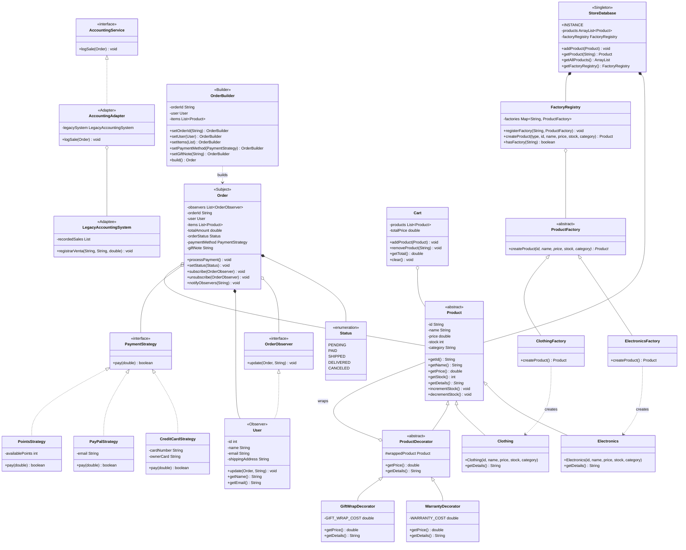

# Diagrama de Clases - ShopTech E-Commerce

## 7 Patrones de Diseño GoF

## Resumen de Patrones

| Patron | Tipo | Clases Involucradas |
|--------|------|---------------------|
| **Singleton** | Creacional | `StoreDatabase` |
| **Factory Method** | Creacional | `ProductFactory`, `ElectronicsFactory`, `ClothingFactory`, `FactoryRegistry` |
| **Builder** | Creacional | `Order.OrderBuilder`, `Order` |
| **Strategy** | Comportamiento | `PaymentStrategy`, `CreditCardStrategy`, `PayPalStrategy`, `PointsStrategy` |
| **Observer** | Comportamiento | `Order` (Subject), `OrderObserver`, `User` (Observer) |
| **Decorator** | Estructural | `ProductDecorator`, `WarrantyDecorator`, `GiftWrapDecorator` |
| **Adapter** | Estructural | `AccountingService` (Target), `AccountingAdapter`, `LegacyAccountingSystem` (Adaptee) |
